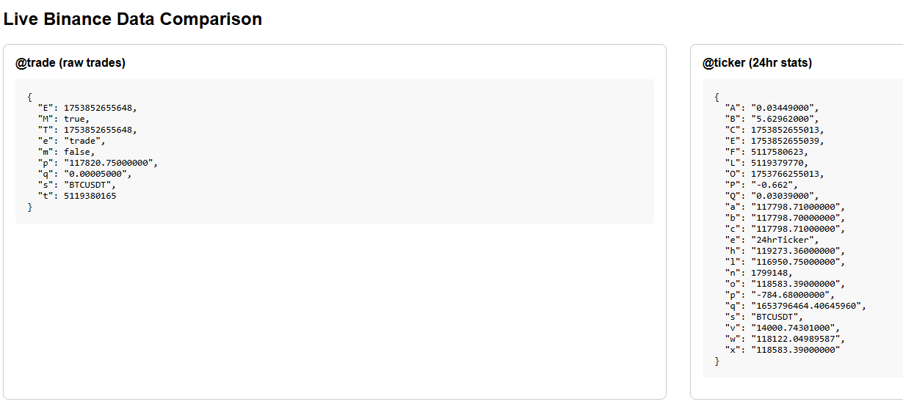

# Real-Time Tick Aggregator

Subscribes to a Redis pub/sub channel to receive real-time tick data and aggregates it minute-by-minute (OHLCV).

## Working


## Dashboard


## /chart


## /compare


## Redis Installation

1. Install Windows Subsytem for Linux 
   ```bash
   wsl --install -d ubuntu

2. Launch Ubuntu

3. Install Redis 
   ```bash
   sudo apt install redis

4. Start server
   ```bash
   sudo systemctl start redis

## Starting Application

1. Install dependencies:
   ```bash
   pip install -r requirements.txt

2. Run the App:
   ```bash
   python app.py

3. Run Comparison:
   ```bash
   python compare.py

## Docs

https://developers.binance.com/docs/binance-spot-api-docs/web-socket-streams
